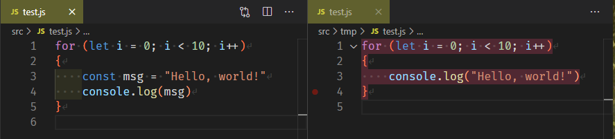

# Workspace Watchdog

Helps you to understand where you are right now - by changing text background color in files outside your workspace folder.

## Example

For example, you do not want to mess code from `./src/` with `./src/tmp/`:

- `settings.json:`

```json
    "workspaceWatchdog.backgroundColor": "rgba(80,40,50,1)",
    "workspaceWatchdog.excludeFolders": [
        "./src/tmp/",
    ]
```

- These are how your open editors will look like:



## Usage

By default, all files outside your workspace folder will be highlighted. However, you can manually enter folders that you want to be highlighted through `workspaceWatchdog.excludeFolders` or change your allowlist through `workspaceWatchdog.includeFolders`.
